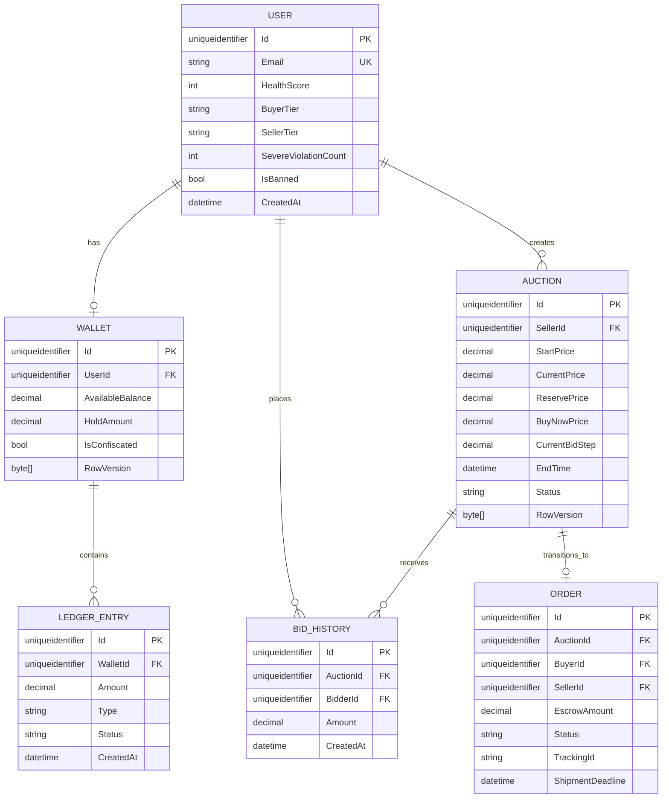

# SafeBid — System Specification (V5 Standard)

## 1. Objective
Xây dựng một nền tảng đấu giá C2C (Event-Driven C2C Auction Platform) phân tán, đạt chuẩn production-ready, tập trung giải quyết các bài toán hóc búa về System Design như Clean Architecture, Concurrency Control, Transactional Safety, và phòng chống gian lận.

## 2. Architecture
Hệ thống thiết kế theo mô hình Microservices tinh gọn:
- **Frontend (FE)**: Web Client giao tiếp với Backend qua REST API và SignalR.
- **Backend (BE)**: Chia làm 2 services:
  - **Service A (Core Auction Engine)**: Xử lý đấu giá, ví, quản trị người dùng.
  - **Service B (Mock Logistics)**: API giả lập vận chuyển độc lập.
- **Database (DB)**: SQL Server cho dữ liệu chính (RowVersion enabled).
- **Dịch vụ ngoài**:
  - Redis: RedLock (chống race condition) & Caching & JWT Blacklist.
  - MinIO: Object Storage (chuẩn S3) quản lý hình ảnh/video bằng chứng.
  - Hangfire: Quản lý Background Jobs.

## 3. Tech Stack
- **Backend**: [.NET 10](https://learn.microsoft.com/en-us/dotnet/), ASP.NET Core, EF Core 10, Hangfire, SignalR.
- **Frontend**: [Next.js 15](https://nextjs.org/) (App Router), React, Tailwind CSS, Shadcn UI, Zustand.
- **Infrastructure**: SQL Server, Redis, MinIO (Docker Compose).
- **Testing**: xUnit, Testcontainers, Moq, FluentAssertions.

## 4. Data Model


## 5. API Contract
Toàn bộ chi tiết API Contract (Nguồn Sự Thật) được tham chiếu tại file [docs/api/openapi.yaml](docs/api/openapi.yaml). Các team FE và BE sẽ dựa vào đây để generate client/server stub.

## 6. Auth & Security
- **Authentication**: JWT HttpOnly Cookie, bảo mật chống XSS.
- **Authorization**: Role-based (Admin, User).
- **HMAC-SHA256 Webhooks**: Mọi Webhook Request BẮT BUỘC có header `X-Signature`. Backend xác thực chữ ký dựa trên Raw Body kết hợp Secret Key để chống giả mạo từ bên thứ 3.
- **Replay Prevention**: Timestamp ±5 phút. Idempotency qua Redis.

## 7. Frontend Architecture
- **Next.js App Router**: Dùng Server Components cho SEO và call data ban đầu (Danh sách phiên). Dùng Client Components cho các form tương tác và SignalR real-time.
- **State Management**: 
  - Zustand cho Global State (Session, Notification).
  - React Query / SWR cho remote data fetching nếu cần polling.
  - Context API / Local state cho UI state thông thường.

## 8. Backend Architecture
- **Clean Architecture**: Tách biệt rõ ràng Domain, Application (MediatR CQRS), Infrastructure, Api.
- **Transactional Outbox Pattern**: Đảm bảo an toàn phân tán. Khi ghi log giao hàng (Order) -> ghi bảng `OutboxMessage` chung 1 Transaction. Worker (Hangfire) sẽ quét gọi API Logistics và dùng Polly Exponential Backoff Retry nếu lỗi.
- **Saga Pattern**: Bù trừ (Compensating Entries) nếu Worker hoàn tất giao dịch phân tán bị lỗi. Đảm bảo bảo toàn Audit Trail.

## 9. Project Structure
```text
SafeBid/
├── docker-compose.yml
├── docs/
├── src/
│   ├── Backend/
│   │   ├── SafeBid.Domain/         # Entities, Value Objects, Domain Events, Exceptions
│   │   ├── SafeBid.Application/    # CQRS (MediatR), DTOs, FluentValidation
│   │   ├── SafeBid.Infrastructure/ # EF Core, Redis, MinIO, Hangfire
│   │   ├── SafeBid.Api/            # Minimal APIs, SignalR Hubs, Middlewares
│   │   └── SafeBid.MockLogistics/  # Service B: Minimal API giả lập vận chuyển
│   │
│   ├── Frontend/
│   │   ├── app/                    # Next.js 15 App Router (Pages, Layouts)
│   │   ├── components/             # Reusable UI (Shadcn, custom UI)
│   │   ├── lib/                    # Utils, Axios, SignalR client
│   │   └── stores/                 # Zustand stores
│   │
│   └── Tests/
│       ├── SafeBid.Domain.Tests/
│       ├── SafeBid.Application.Tests/
│       └── SafeBid.IntegrationTests/ # Testcontainers setup
```

## 10. Environments & Config
```env
# Database
DB_CONNECTION_STRING=Server=tcp:localhost,1433;Initial Catalog=SafeBidDb;User ID=sa;Password=Your_password123;Encrypt=False

# Redis
REDIS_CONNECTION=localhost:6379

# MinIO
MINIO_ENDPOINT=localhost:9000
MINIO_ACCESS_KEY=admin
MINIO_SECRET_KEY=password123

# JWT & HMAC Auth
JWT_SECRET=super_secret_jwt_key_at_least_32_chars
WEBHOOK_HMAC_SECRET=webhook_secret_key_123
```

## 11. Commands
```bash
# Khởi chạy hạ tầng (SQL Server, Redis, MinIO)
docker-compose up -d

# Backend
cd src/Backend/SafeBid.Api
dotnet run

# Frontend
cd src/Frontend
npm install
npm run dev

# Testing
dotnet test
```

## 12. Testing Strategy
- **Unit Testing**: xUnit, Moq, FluentAssertions bao phủ 100% Core Domain Logic (Calculations, Proxy Resolution, Health Score).
- **Integration Testing**: BẮT BUỘC dùng **Testcontainers** (dựng Docker DB, Redis thật trong quá trình chạy test) để kiểm chứng RowVersion (Concurrency) và RedLock, không dùng In-Memory Database.

## 13. Code Conventions

Quy ước chuẩn: CamelCase cho biến/hàm FE. PascalCase cho class/method BE.

**Backend (C#) - Result Pattern & Early Return**
- ❌ **Sai**: Throw exception bừa bãi và lồng ghép `if/else`.
```csharp
public void PlaceBid(Guid id, decimal amount) {
    var auction = _db.Auctions.Find(id);
    if (auction != null) {
        if (auction.Status == "ACTIVE") {
            // Logic...
        } else {
            throw new Exception("Not active");
        }
    } else {
        throw new Exception("Not found");
    }
}
```
- ✅ **Đúng**: Dùng Result Pattern và Early Return (Fail fast).
```csharp
public async Task<Result<Unit>> Handle(PlaceBidCommand request, CancellationToken ct) {
    var auction = await _repository.GetByIdAsync(request.AuctionId, ct);
    if (auction is null)
        return Result.Failure(DomainErrors.Auction.NotFound);

    if (auction.Status != AuctionStatus.Active)
        return Result.Failure(DomainErrors.Auction.NotActive);

    // Business Logic...
    return Result.Success(Unit.Value);
}
```

**Frontend (React/TypeScript) - Component Design**
- ❌ **Sai**: Nhồi nhét logic fetch data và tính toán trực tiếp vào UI. Dùng `any`.
```tsx
const BidButton = (props: any) => {
    const doBid = async () => {
        await axios.post('/bids', { val: props.val });
    }
    return <button onClick={doBid}>Bid</button>;
}
```
- ✅ **Đúng**: Tách logic ra Custom Hook. Định nghĩa interface rõ ràng.
```tsx
interface BidButtonProps {
    auctionId: string;
    maxBid: number;
}

export const BidButton: React.FC<BidButtonProps> = ({ auctionId, maxBid }) => {
    const { placeBid, isLoading } = usePlaceBid(auctionId);

    return (
        <Button onClick={() => placeBid(maxBid)} disabled={isLoading}>
            {isLoading ? 'Đang đặt...' : 'Đặt Giá'}
        </Button>
    );
}
```
