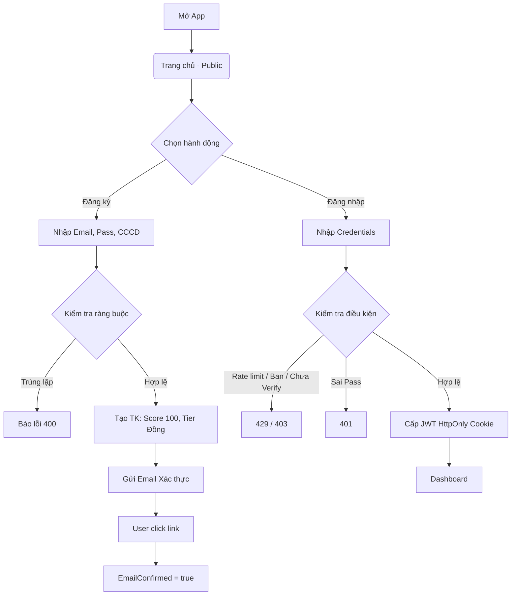
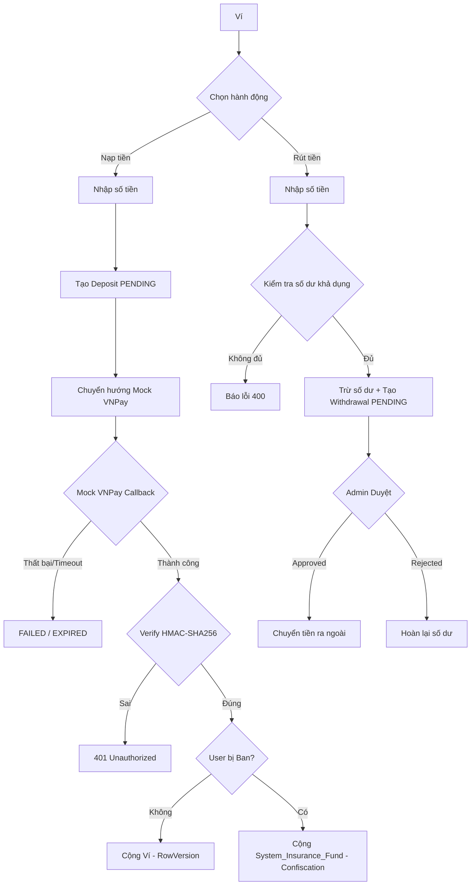
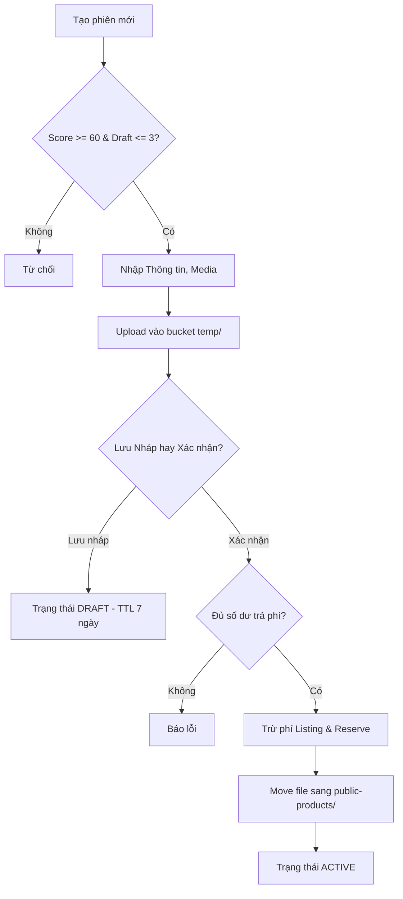
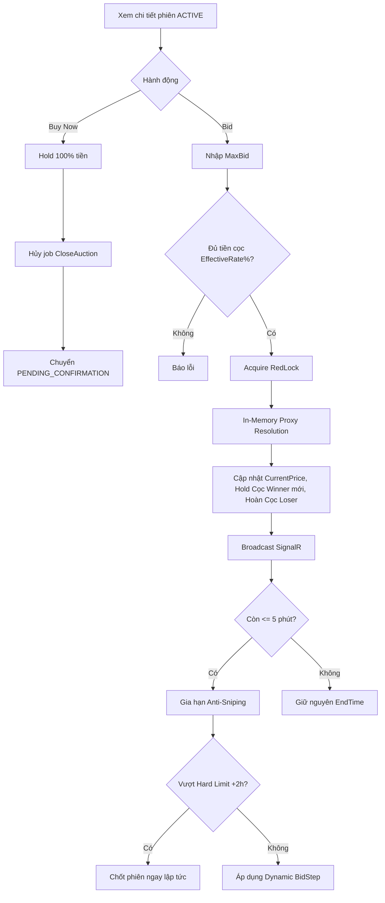
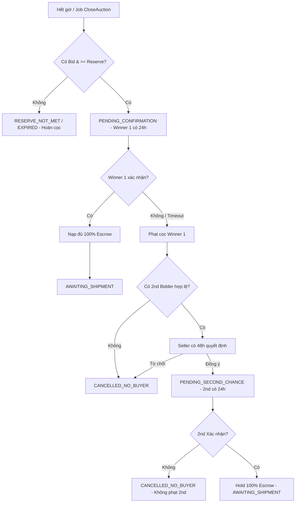
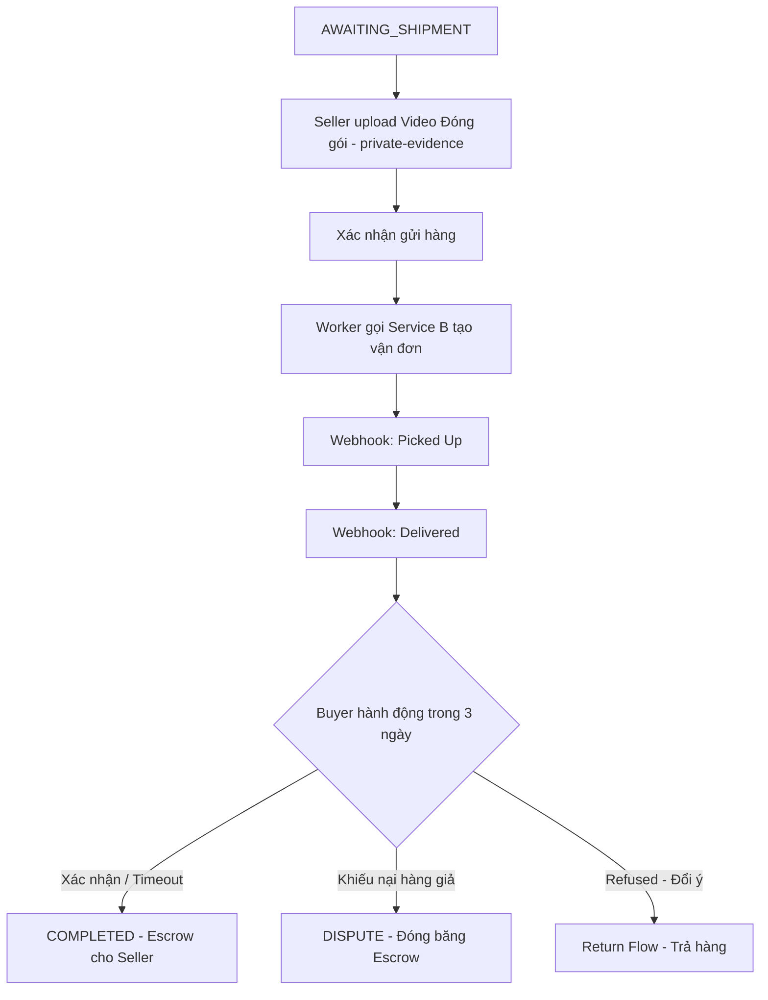
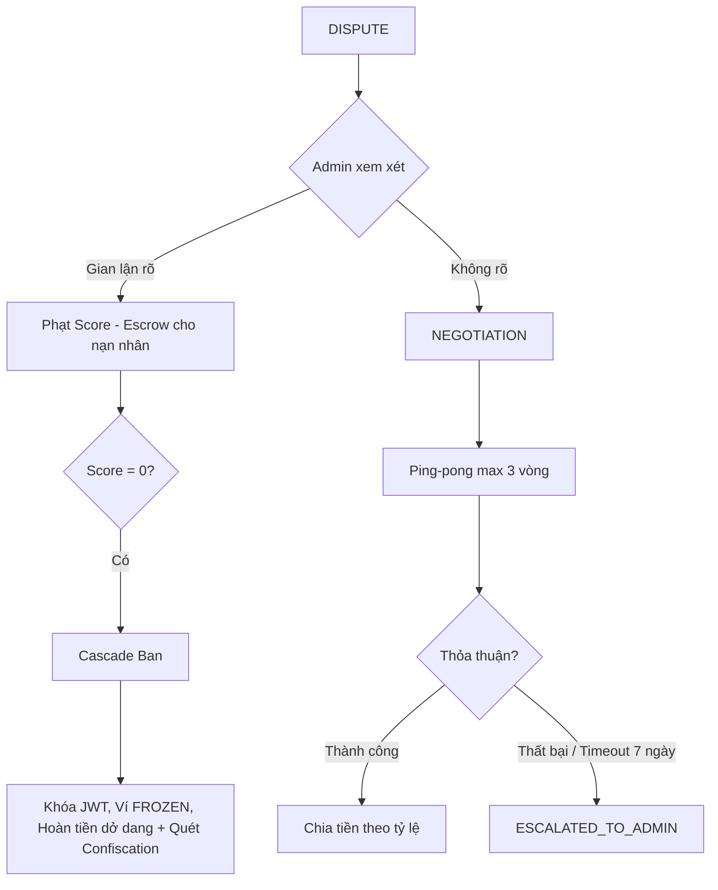

# SafeBid — USER_FLOW.md (v7 — Final)

> Sơ đồ luồng (Mermaid Flowchart) cho các nghiệp vụ SafeBid theo chuẩn Vibe Code V5.

## 1. Đăng Ký & Đăng Nhập

## 2. Nạp Tiền & Rút Tiền

## 3. Tạo Phiên (Seller)

## 4. Đặt Giá (Proxy Bidding) & Buy Now

## 5. Chốt Phiên & Second Chance

## 6. Giao Hàng & Nhận Hàng

## 7. Tranh Chấp (Ping-pong) & Ban

---

## DANH SÁCH MÀN HÌNH

| Tên màn hình | Role truy cập | Dữ liệu hiển thị | Các hành động (Nút bấm) |
|--------------|---------------|------------------|-------------------------|
| **Trang Chủ** | All (Khách, User, Admin) | Danh sách phiên (Ảnh bìa, Giá, Countdown, Filter/Search). | Đăng ký, Đăng nhập, Xem chi tiết, Theo dõi (Watchlist). |
| **Auth (Login/Register)** | Khách | Form nhập liệu (Email, Mật khẩu, CCCD, Họ tên, SĐT). | Submit Đăng ký / Đăng nhập / Quên MK. |
| **Dashboard / Hồ Sơ** | User đã ĐN | Thông tin user, HealthScore, Tier, Danh sách địa chỉ. | Thêm/Sửa/Xóa địa chỉ, Đặt mặc định, Xem lịch sử GD. |
| **Ví (Wallet)** | User đã ĐN | Số dư Available, số tiền đang Hold, Lịch sử Nạp/Rút/Trừ cọc. | Nạp tiền, Rút tiền. |
| **Tạo Phiên (Draft)** | Seller | Form nhập liệu (Tên, Giá, Ảnh/Video temp, Reserve Price, Duration). | Upload, Lưu Nháp, Xác nhận đăng. |
| **Chi Tiết Phiên** | All (Bidder cần ĐN) | Ảnh/Video (public), Giá hiện tại, BidStep, Countdown, Public Bid History, Q&A, Badge "Chưa đạt sàn". | Đặt giá (Bid), Buy Now, Theo dõi, Hỏi đáp. |
| **Xác Nhận Mua (Checkout)**| Winner / 2nd Bidder | Giá Final, Cọc đang Hold, Tiền cần nạp thêm, Chọn địa chỉ. | Nạp tiền (nếu thiếu), Xác nhận thanh toán (100% Escrow). |
| **Quản Lý Đơn Hàng** | Buyer / Seller | List Order, Trạng thái (AWAITING_SHIPMENT, SHIPPED...), Contact Reveal/Mask. | Đổi địa chỉ (Buyer), Upload video đóng gói (Seller), Giao hàng. |
| **Chi Tiết Đơn Hàng** | Buyer / Seller | Tracking từ Service B, Deadline, SĐT/Zalo đối tác (nếu chưa Mask). | Xác nhận nhận hàng, Khiếu nại (Dispute), Trả hàng (Refused). |
| **Tranh Chấp (Dispute)** | Admin, Buyer, Seller | Lịch sử Chat/Ping-pong, Bằng chứng Video (Presigned URL). | Đề xuất Tỷ lệ %, Chấp nhận %, Admin Phán Quyết. |
| **Admin Panel** | Admin | Danh sách User, Lịch sử Giao dịch, Lệnh Rút tiền PENDING. | Duyệt lệnh Rút tiền, Ban User, Xem Log. |
