# Kế Hoạch Triển Khai SafeBid (Enterprise Vertical Slices - V5)

```mermaid
flowchart TD
    S1[✅ SPIKE 1: RedLock In-Memory] --> S2[✅ SPIKE 2: HMAC Webhook]
    S2 -.-> CP1((🔍 CHECKPOINT 1))
    
    CP1 --> T1[Task 1: Auth Register API]
    T1 --> T2[Task 2: Auth Register UI]
    T2 --> T3[Task 3: Auth Login API & JWT]
    T3 --> T4[Task 4: Auth Login UI]
    
    T4 -.-> CP2((🔍 CHECKPOINT 2))
    
    CP2 --> T5[Task 5: Deposit Webhook Core]
    T5 --> T6[Task 6: Wallet Concurrency API]
    T6 --> T7[Task 7: Wallet UI]
    
    T7 -.-> CP3((🔍 CHECKPOINT 3))
    
    CP3 --> T8[Task 8: Auction MinIO API]
    T8 --> T9[Task 9: Auction Draft UI]
    T9 --> T10[Task 10: Auction Publish API]
    T10 --> T11[Task 11: Auction List & Details UI]
    T11 --> T12[Task 12: Auction Watchlist & Bid History]
    T12 --> T13[Task 13: Auction Q&A]
    
    T13 -.-> CP4((🔍 CHECKPOINT 4))
    
    CP4 --> T14[Task 14: Proxy Bidding - Deposit Calculator]
    T14 --> T15[Task 15: Proxy Bidding - Core Execution]
    T15 --> T16[Task 16: Proxy Bidding - SignalR]
    T16 --> T17[Task 17: Proxy Bidding - UI]
    T17 --> T18[Task 18: Buy Now - Core API]
    T18 --> T19[Task 19: Anti-Sniping - Hard Limit & BidStep]
    
    T19 -.-> CP5((🔍 CHECKPOINT 5))
    
    CP5 --> T20[Task 20: Checkout Escrow API]
    T20 --> T21[Task 21: Order - Change Shipping Address]
    T21 --> T22[Task 22: Winner Timeout Penalty Worker]
    T22 --> T23[Task 23: 2nd Chance - Seller Decision]
    T23 --> T24[Task 24: 2nd Chance - Bidder Confirmation]
    
    T24 -.-> CP6((🔍 CHECKPOINT 6))
    
    CP6 --> T25[Task 25: Shipping Outbox API]
    T25 --> T26[Task 26: Logistics Forward & Forward LOST API]
    T26 --> T27[Task 27: Order Management UI]
    
    T27 -.-> CP7((🔍 CHECKPOINT 7))
    
    CP7 --> T28[Task 28: Return Flow - Initiation]
    T28 --> T29[Task 29: Return Flow - Tracking & Return LOST]
    T29 --> T30[Task 30: Return Flow - Seal Check & Dispute]
    
    T30 -.-> CP8((🔍 CHECKPOINT 8))
    
    CP8 --> T31[Task 31: Dispute Ping-Pong Core]
    T31 --> T32[Task 32: Dispute Ping-Pong UI]
    T32 --> T33[Task 33: Dispute - Admin SLA & Liability]
    
    T33 -.-> CP9((🔍 CHECKPOINT 9))
    
    CP9 --> T34[Task 34: Privacy Data Masking API]
    T34 --> T35[Task 35: Reputation Engine - Dual-Tier]
    T35 --> T36[Task 36: Auto-Ban Worker]
    T36 --> T37[Task 37: Admin Ban & Mutual Ban]
    T37 --> T38[Task 38: Admin Sweep Cascade API]
    T38 --> T39[Task 39: Admin Dashboard UI]
    T39 --> T40[Task 40: Notifications & Hangfire Emails]
```

## ✅ SPIKE 1: RedLock & In-Memory Resolution (HOÀN THÀNH)

## ✅ SPIKE 2: HMAC-SHA256 Webhook & Idempotency (HOÀN THÀNH)

---
🔍 CHECKPOINT REVIEW 1
---

## Task 1: Auth Register API (F1)
- **Mục tiêu**: Xử lý đăng ký tài khoản và Rate Limiting 5 lần/phút.
- **Tiêu chí hoàn thành (Given/When/Then)**: Given user hợp lệ, When POST đăng ký, Then lưu DB với HealthScore=100.
- **Lớp chạm tới**: DB (Bảng Users) / API.
- **Endpoint | Màn hình**: `POST /api/auth/register` | Không UI.
- **File dự kiến**: `RegisterCommand.cs`, `AuthController.cs`, `User.cs`.
- **Test (Bắt buộc TDD)**: 
  - Ca bình thường: Đăng ký thành công trả về UserId.
  - Edge case 1: Email đã tồn tại -> mong đợi HTTP 400 Bad Request.
  - Edge case 2: Spam đăng ký 6 lần/phút -> mong đợi HTTP 429 Too Many Requests.
- **Skill / MCP gợi ý**: `test-driven-development`.
- **Rủi ro liên quan**: Không.
- **Testing Steps để test tay**: Postman gọi 6 lần liên tiếp xem báo 429 không.
- **Phụ thuộc**: Không.

## Task 2: Auth Register UI (F1)
- **Mục tiêu**: Xây dựng màn hình Đăng ký phía Next.js.
- **Tiêu chí hoàn thành (Given/When/Then)**: Given form điền đủ, When bấm nút, Then hiện Loading, gọi API và hiện Success toast.
- **Lớp chạm tới**: UI (Page, Form Component).
- **Endpoint | Màn hình**: Gọi `POST /api/auth/register` | Trang Đăng ký (`/register`).
- **File dự kiến**: `RegisterPage.tsx`, `useAuth.ts`, `Button.tsx`, `Input.tsx`.
- **Test (Bắt buộc TDD)**: 
  - Ca bình thường: Nhập email/pass hợp lệ, form gọi fetch.
  - Edge case 1: Không nhập gì bấm Submit -> mong đợi hiện Error text đỏ (Validation Zod).
- **Skill / MCP gợi ý**: `frontend-ui-engineering`.
- **Rủi ro liên quan**: Không.
- **Testing Steps để test tay**: Mở localhost:3000/register, nhập linh tinh để xem validation, nhập chuẩn để xem Loading.
- **Phụ thuộc**: Task 1.

## Task 3: Auth Login API & JWT (F1)
- **Mục tiêu**: Đăng nhập và set HttpOnly Cookie an toàn.
- **Tiêu chí hoàn thành (Given/When/Then)**: Given login chuẩn, When API xử lý, Then Append-Cookie HttpOnly chứa JWT.
- **Lớp chạm tới**: API (Tạo JWT, Cookie).
- **Endpoint | Màn hình**: `POST /api/auth/login`, `GET /api/users/me` | Không UI.
- **File dự kiến**: `LoginCommand.cs`, `JwtProvider.cs`, `CurrentUserMiddleware.cs`.
- **Test (Bắt buộc TDD)**: 
  - Ca bình thường: Trả về 200 OK + Set-Cookie header.
  - Edge case 1: Sai mật khẩu -> mong đợi HTTP 401.
  - Edge case 2: Gọi `/api/users/me` mà không có Cookie -> mong đợi HTTP 401.
- **Skill / MCP gợi ý**: `security-and-hardening`.
- **Rủi ro liên quan**: XSS (nếu JWT lưu LocalStorage).
- **Testing Steps để test tay**: Dùng browser thử login API, check tab Application > Cookies xem có cờ HttpOnly không.
- **Phụ thuộc**: Task 1.

## Task 4: Auth Login UI (F1)
- **Mục tiêu**: Form Login và quản lý State bằng Zustand.
- **Tiêu chí hoàn thành (Given/When/Then)**: Given nhập đúng pass, When login xong, Then chuyển hướng về Trang chủ và State cập nhật.
- **Lớp chạm tới**: UI.
- **Endpoint | Màn hình**: Gọi `POST /api/auth/login` | Trang Đăng nhập (`/login`).
- **File dự kiến**: `LoginPage.tsx`, `authStore.ts`.
- **Test (Bắt buộc TDD)**: 
  - Ca bình thường: Login thành công -> zustand isAuthenticated = true.
  - Edge case 1: Server sập -> mong đợi form hiện Error rực rỡ nhưng không crash UI.
- **Skill / MCP gợi ý**: `frontend-ui-engineering`.
- **Rủi ro liên quan**: SSR mismatch cho trạng thái đăng nhập.
- **Testing Steps để test tay**: Login trên UI, refresh trang xem trạng thái Login có bị mất không (fetch `/me`).
- **Phụ thuộc**: Task 2, Task 3.

---
🔍 CHECKPOINT REVIEW 2
---

## Task 5: Deposit Webhook Core (F3)
- **Mục tiêu**: Áp dụng SPIKE 2 vào nghiệp vụ nạp tiền thực tế.
- **Tiêu chí hoàn thành (Given/When/Then)**: Given webhook SUCCESS, When xác thực xong, Then tạo Transaction, cộng tiền ví.
- **Lớp chạm tới**: DB (Bảng WalletTransaction) / API.
- **Endpoint | Màn hình**: `POST /api/webhooks/deposit` | Không UI.
- **File dự kiến**: `DepositWebhookCommand.cs`, `WalletTransaction.cs`.
- **Test (Bắt buộc TDD)**: 
  - Ca bình thường: Cộng 100k vào Wallet, sinh 1 record Transaction.
  - Edge case 1: User bị Ban (IsConfiscated=true) -> mong đợi tiền không vào ví mà redirect sang System_Insurance_Fund (DEPOSIT_CONFISCATION).
- **Skill / MCP gợi ý**: `dotnet-architect`.
- **Rủi ro liên quan**: RISKS.md #4 (Webhook giả mạo).
- **Testing Steps để test tay**: Bắn webhook chuẩn, check DB xem có tiền không. Bắn webhook khi User bị Ban.
- **Phụ thuộc**: SPIKE 2, Task 3.

## Task 6: Wallet Concurrency API (F3)
- **Mục tiêu**: Quản lý số dư và ngăn trừ lố bằng RowVersion.
- **Tiêu chí hoàn thành (Given/When/Then)**: Given rút tiền, When số dư đủ, Then trừ tiền, nếu có 2 req chạm nhau thì văng DbUpdateConcurrencyException.
- **Lớp chạm tới**: DB (Bảng Wallet thêm RowVersion) / API.
- **Endpoint | Màn hình**: `GET /api/wallet/balance`, `POST /api/wallet/withdraw` | Không UI.
- **File dự kiến**: `Wallet.cs`, `WithdrawCommand.cs`.
- **Test (Bắt buộc TDD)**: 
  - Ca bình thường: Số dư 100k, rút 50k -> còn 50k.
  - Edge case 1: Trừ tiền khi số dư bằng 0 -> mong đợi Exception InsufficientFunds.
  - Edge case 2: 2 luồng cùng rút 100k (Concurrent) -> mong đợi 1 luồng trừ thành công, luồng kia dính DbUpdateConcurrencyException.
- **Skill / MCP gợi ý**: `database-design`, `doubt-driven-development`.
- **Rủi ro liên quan**: RISKS.md #2 (Trừ lố).
- **Testing Steps để test tay**: Bắn 2 POST rút tiền song song bằng Postman.
- **Phụ thuộc**: Task 5.

## Task 7: Wallet UI (F3)
- **Mục tiêu**: Màn hình xem số dư và lịch sử giao dịch.
- **Tiêu chí hoàn thành (Given/When/Then)**: Given ở trang ví, When fetch, Then hiện số dư và list Lịch sử.
- **Lớp chạm tới**: UI.
- **Endpoint | Màn hình**: Gọi GET Wallet | Trang Ví.
- **File dự kiến**: `WalletPage.tsx`, `TransactionList.tsx`.
- **Test (Bắt buộc TDD)**: 
  - Ca bình thường: Render số dư đúng định dạng VND.
  - Edge case 1: API trả về 500 -> mong đợi UI hiện màn hình Error state, có nút Thử lại.
- **Skill / MCP gợi ý**: `frontend-ui-engineering`.
- **Rủi ro liên quan**: Không.
- **Testing Steps để test tay**: F5 trang, đảm bảo Loading state hiện lên đẹp và mượt.
- **Phụ thuộc**: Task 6.

---
🔍 CHECKPOINT REVIEW 3
---

## Task 8: Auction MinIO API (F4)
- **Mục tiêu**: API upload file bằng chứng (Bucket temp).
- **Tiêu chí hoàn thành (Given/When/Then)**: Given file ảnh hợp lệ, When upload, Then đẩy lên MinIO và trả về URL.
- **Lớp chạm tới**: API (MinIO Client).
- **Endpoint | Màn hình**: `POST /api/media/upload` | Không UI.
- **File dự kiến**: `MinioService.cs`, `UploadMediaCommand.cs`.
- **Test (Bắt buộc TDD)**: 
  - Ca bình thường: Upload file JPG < 5MB thành công.
  - Edge case 1: Upload file .exe -> mong đợi HTTP 400 Invalid Extension.
- **Skill / MCP gợi ý**: `security-and-hardening`.
- **Rủi ro liên quan**: Trash files, RCE qua ảnh.
- **Testing Steps để test tay**: Up file png, kiểm tra console MinIO xem file có trong bucket temp không.
- **Phụ thuộc**: Không.

## Task 9: Auction Draft UI (F4)
- **Mục tiêu**: Form tạo nháp Phiên Đấu Giá.
- **Tiêu chí hoàn thành (Given/When/Then)**: Given Seller điền tên, giá, ảnh, When bấm Lưu Nháp, Then gọi API tạo Auction trạng thái DRAFT.
- **Lớp chạm tới**: DB (Bảng Auction) / API / UI.
- **Endpoint | Màn hình**: `POST /api/auctions` | Trang Tạo Phiên.
- **File dự kiến**: `CreateAuctionCommand.cs`, `Auction.cs`, `CreateAuctionPage.tsx`.
- **Test (Bắt buộc TDD)**: 
  - Ca bình thường: Trả về AuctionId, status DRAFT.
  - Edge case 1: Seller Score < 60 -> mong đợi HTTP 403 Forbidden.
- **Skill / MCP gợi ý**: `frontend-ui-engineering`.
- **Rủi ro liên quan**: Không.
- **Testing Steps để test tay**: Điền form, up ảnh, bấm lưu nháp.
- **Phụ thuộc**: Task 8.

## Task 10: Auction Publish API (F4)
- **Mục tiêu**: Xuất bản Phiên, trừ Phí lên sàn.
- **Tiêu chí hoàn thành (Given/When/Then)**: Given Auction DRAFT, When Publish, Then trừ phí `Max(20k, 2% ReservePrice)` từ Wallet, chuyển file sang public, status ACTIVE.
- **Lớp chạm tới**: DB (Transaction liên bảng) / API.
- **Endpoint | Màn hình**: `POST /api/auctions/{id}/publish` | Không UI.
- **File dự kiến**: `PublishAuctionCommand.cs`, `AuctionDomainService.cs`.
- **Test (Bắt buộc TDD)**: 
  - Ca bình thường: Publish thành công, số dư trừ phí, status = ACTIVE.
  - Edge case 1: Không đủ tiền ví -> mong đợi Exception InsufficientFunds, status vẫn DRAFT, không dời file MinIO.
- **Skill / MCP gợi ý**: `dotnet-architect`.
- **Rủi ro liên quan**: Lỗi mạng lúc dời file MinIO nhưng tiền ví đã trừ.
- **Testing Steps để test tay**: API call publish khi ví chỉ có 10k -> lỗi. Bơm ví lên 50k -> thành công.
- **Phụ thuộc**: Task 6, Task 9.

## Task 11: Auction List & Details UI (F4)
- **Mục tiêu**: Hiển thị danh sách và chi tiết các phiên ACTIVE.
- **Tiêu chí hoàn thành (Given/When/Then)**: Given vào trang chủ, When load, Then thấy list ACTIVE auctions.
- **Lớp chạm tới**: API / UI.
- **Endpoint | Màn hình**: `GET /api/auctions`, `GET /api/auctions/{id}` | Trang chủ, Trang Chi tiết.
- **File dự kiến**: `GetAuctionsQuery.cs`, `HomePage.tsx`, `AuctionDetails.tsx`.
- **Test (Bắt buộc TDD)**: 
  - Ca bình thường: List 10 auctions phân trang.
  - Edge case 1: Auction DRAFT thì người khác gọi API GET /id -> mong đợi 404 hoặc 403.
- **Skill / MCP gợi ý**: `performance-optimization`.
- **Rủi ro liên quan**: N+1 queries.
- **Testing Steps để test tay**: Vào trang chủ xem list.
- **Phụ thuộc**: Task 10.

## Task 12: Auction Watchlist & Bid History (F4, Engagement)
- **Mục tiêu**: Chức năng theo dõi phiên (Watchlist) và xem lịch sử đặt giá công khai.
- **Tiêu chí hoàn thành (Given/When/Then)**: Given User bấm thả tim, Then lưu vào Watchlist. Given truy cập lịch sử, Then thấy danh sách Bid (tên người dùng bị ẩn danh 1 phần).
- **Lớp chạm tới**: DB (Bảng Watchlist) / API / UI.
- **Endpoint | Màn hình**: `POST /api/auctions/{id}/watch`, `GET /api/auctions/{id}/bids` | Nút Tim, Tab Lịch sử Bid.
- **File dự kiến**: `WatchlistCommand.cs`, `GetBidHistoryQuery.cs`, `WatchlistButton.tsx`.
- **Test (Bắt buộc TDD)**: 
  - Ca bình thường: Bấm Watch -> Trả về 200 OK.
  - Edge case 1: Trả về Bid History nhưng phải ẩn 3 số cuối điện thoại hoặc tên (VD: `Nguyễn V***`).
- **Skill / MCP gợi ý**: `frontend-ui-engineering`.
- **Rủi ro liên quan**: Lộ danh tính Bidder.
- **Testing Steps để test tay**: Bấm theo dõi phiên, kiểm tra lịch sử giá xem danh tính có bị lộ không.
- **Phụ thuộc**: Task 11.

## Task 13: Auction Q&A (Engagement)
- **Mục tiêu**: Hỏi đáp công khai trên Phiên đấu giá.
- **Tiêu chí hoàn thành (Given/When/Then)**: Given User đặt câu hỏi, Then Seller nhận được thông báo để trả lời. Question & Answer hiện công khai trên trang chi tiết.
- **Lớp chạm tới**: DB (Bảng Q&A) / API / UI.
- **Endpoint | Màn hình**: `POST /api/auctions/{id}/questions` | Tab Hỏi Đáp.
- **File dự kiến**: `Question.cs`, `AddQuestionCommand.cs`, `QnAPanel.tsx`.
- **Test (Bắt buộc TDD)**: 
  - Ca bình thường: Thêm câu hỏi -> Trả về 201 Created.
  - Edge case 1: Spam 10 câu hỏi/phút -> mong đợi 429 Rate Limit.
- **Skill / MCP gợi ý**: `test-driven-development`.
- **Rủi ro liên quan**: Không.
- **Testing Steps để test tay**: User hỏi, Seller vào trả lời.
- **Phụ thuộc**: Task 11.

---
🔍 CHECKPOINT REVIEW 4
---

## Task 14: Proxy Bidding - Deposit Calculator (F5)
- **Mục tiêu**: Tính toán `EffectiveDepositRate` dựa trên Dual-Tier và Health Score Demotion.
- **Tiêu chí hoàn thành (Given/When/Then)**: Given User đặt MaxBid, When hệ thống tính tiền cọc, Then Rate = `Min(DepositRate(BuyerTier), DepositRate(SellerTier))`. Nếu HealthScore < ngưỡng, giáng cấp cọc xuống rate thấp hơn.
- **Lớp chạm tới**: Domain Logic.
- **Endpoint | Màn hình**: (Logic Layer - Sử dụng ở Task tiếp theo).
- **File dự kiến**: `DepositCalculatorService.cs`, `TierRates.cs`.
- **Test (Bắt buộc TDD)**: 
  - Ca bình thường: Buyer (Silver - 10%), Seller (Bronze - 15%) -> Rate = 10%. Đặt MaxBid 1 triệu -> Hold 100k.
  - Edge case 1: Buyer Gold (5%) nhưng HealthScore = 70 (dưới ngưỡng 80) -> mong đợi giáng xuống Silver (10%).
- **Skill / MCP gợi ý**: `test-driven-development`.
- **Rủi ro liên quan**: Lỗ hổng tính tiền cọc sai.
- **Testing Steps để test tay**: (Được test qua API Bidding ở task sau).
- **Phụ thuộc**: Không.

## Task 15: Proxy Bidding - Core Execution (F5)
- **Mục tiêu**: Tích hợp RedLock và giải quyết Proxy Bidding In-Memory.
- **Tiêu chí hoàn thành (Given/When/Then)**: Given MaxBid từ Buyer, When xử lý, Then dùng RedLock, tính toán cọc (Task 14), Hold tiền Wallet, so kè MaxBid in-memory, lưu DB 1 lần.
- **Lớp chạm tới**: DB (Bảng Bids) / API.
- **Endpoint | Màn hình**: `POST /api/auctions/{id}/bids` | Không UI.
- **File dự kiến**: `PlaceBidCommand.cs`, `BidEngine.cs`.
- **Test (Bắt buộc TDD)**: 
  - Ca bình thường: Bid hợp lệ -> Hold tiền, cập nhật WinningUserId.
  - Edge case 1: Tiền ví không đủ HoldAmount -> mong đợi HTTP 400 InsufficientHold.
  - Edge case 2: Đặt giá khi Auction đã kết thúc -> mong đợi HTTP 400 AuctionClosed.
- **Skill / MCP gợi ý**: `doubt-driven-development`.
- **Rủi ro liên quan**: RISKS.md #1 (Race condition khi Bid).
- **Testing Steps để test tay**: Dùng postman bid, xem HoldAmount tăng đúng tỷ lệ.
- **Phụ thuộc**: SPIKE 1, Task 14.

## Task 16: Proxy Bidding - SignalR (F5)
- **Mục tiêu**: Bắn thông báo Real-time khi giá nhảy.
- **Tiêu chí hoàn thành (Given/When/Then)**: Given giá CurrentPrice thay đổi, When PlaceBid xong, Then gửi Ping qua SignalR tới nhóm.
- **Lớp chạm tới**: API (SignalR Hub).
- **Endpoint | Màn hình**: `Hub /hubs/auction` | Không UI.
- **File dự kiến**: `AuctionHub.cs`, `BidPlacedEvent.cs`.
- **Test (Bắt buộc TDD)**: 
  - Ca bình thường: Gửi message "AuctionUpdated" kèm AuctionId cho Group.
- **Skill / MCP gợi ý**: `dotnet-architect`.
- **Rủi ro liên quan**: Gửi nhầm Info nhạy cảm qua SignalR.
- **Testing Steps để test tay**: Code client console test nhận event.
- **Phụ thuộc**: Task 15.

## Task 17: Proxy Bidding - UI (F5)
- **Mục tiêu**: Nút Đặt giá, Modal, và đồng bộ SignalR.
- **Tiêu chí hoàn thành (Given/When/Then)**: Given SignalR ping, When nhận được, Then UI fetch lại giá.
- **Lớp chạm tới**: UI.
- **Endpoint | Màn hình**: Trang Chi Tiết Phiên.
- **File dự kiến**: `BiddingModal.tsx`, `useAuctionSignalR.ts`.
- **Test (Bắt buộc TDD)**: 
  - Ca bình thường: UI nhảy giá lập tức.
  - Edge case 1: SignalR đứt kết nối -> mong đợi cơ chế tự reconnect.
- **Skill / MCP gợi ý**: `frontend-ui-engineering`.
- **Rủi ro liên quan**: Không.
- **Testing Steps để test tay**: Mở 2 tab, tab 1 bid, tab 2 tự nhảy.
- **Phụ thuộc**: Task 11, Task 16.

---
🔍 CHECKPOINT REVIEW 5
---

## Task 18: Buy Now - Core API (F5)
- **Mục tiêu**: Chức năng Mua Ngay, chốt phiên lập tức.
- **Tiêu chí hoàn thành (Given/When/Then)**: Given User bấm Buy Now, When xử lý, Then Hold 100% giá BuyNow, đóng phiên ngay lập tức, hủy bỏ các Bid khác.
- **Lớp chạm tới**: DB / API.
- **Endpoint | Màn hình**: `POST /api/auctions/{id}/buy-now` | Không UI.
- **File dự kiến**: `BuyNowCommand.cs`.
- **Test (Bắt buộc TDD)**: 
  - Ca bình thường: Buy Now -> Auction đóng, Winner = user đó.
  - Edge case 1: Có người đặt Bid cao hơn cả giá Buy Now trước đó -> mong đợi HTTP 400 (Không cho mua ngay nữa).
- **Skill / MCP gợi ý**: `test-driven-development`.
- **Rủi ro liên quan**: Race condition giữa Buy Now và Bid.
- **Testing Steps để test tay**: Bắn Buy Now API, check DB xem Auction đóng chưa.
- **Phụ thuộc**: Task 15.

## Task 19: Anti-Sniping - Hard Limit & BidStep (F5)
- **Mục tiêu**: Chặn spam nhảy giá cuối giờ, áp dụng Dynamic BidStep.
- **Tiêu chí hoàn thành (Given/When/Then)**: Given phiên còn <= 5 phút có bid, When xử lý, Then EndTime += 5 phút (Max Hard Limit +2h gốc) và BidStep thay đổi.
- **Lớp chạm tới**: Domain Logic / API.
- **Endpoint | Màn hình**: (Logic tích hợp vào PlaceBid).
- **File dự kiến**: `AntiSnipingDomainService.cs`.
- **Test (Bắt buộc TDD)**: 
  - Ca bình thường: Bid ở phút cuối -> EndTime tăng lên 5 phút.
  - Edge case 1: Đã chạm ngưỡng Hard Limit (+2h), có bid mới -> mong đợi EndTime không tăng thêm, phiên kết thúc đúng giờ.
  - Edge case 2: CurrentPrice vượt mức mới -> Dynamic BidStep tăng lên (VD: Giá 1tr -> bước 10k, giá 10tr -> bước 50k).
- **Skill / MCP gợi ý**: `doubt-driven-development`.
- **Rủi ro liên quan**: RISKS.md #3 (Business Logic DoS).
- **Testing Steps để test tay**: Sửa EndTime DB còn 1 phút, bắn Bid xem EndTime trên DB có tăng không.
- **Phụ thuộc**: Task 15.

## Task 20: Checkout Escrow API (F6)
- **Mục tiêu**: Winner thanh toán 100% tiền mua vào Escrow, tạo Đơn hàng.
- **Tiêu chí hoàn thành (Given/When/Then)**: Given Auction đóng, When Winner xác nhận, Then chuyển tiền Wallet -> Escrow, tạo Order (AWAITING_SHIPMENT).
- **Lớp chạm tới**: DB (Bảng Order) / API.
- **Endpoint | Màn hình**: `POST /api/auctions/{id}/checkout` | Màn hình Checkout (UI chung task này).
- **File dự kiến**: `CheckoutCommand.cs`, `Order.cs`, `CheckoutPage.tsx`.
- **Test (Bắt buộc TDD)**: 
  - Ca bình thường: Đủ tiền -> Trừ ví, tạo Order.
  - Edge case 1: Người không phải Winner gọi Checkout -> mong đợi HTTP 403 Forbidden.
- **Skill / MCP gợi ý**: `security-and-hardening`.
- **Rủi ro liên quan**: Checkout đúp (Double tạo Order).
- **Testing Steps để test tay**: Bấm thanh toán, check DB Order.
- **Phụ thuộc**: Task 18, 19.

## Task 21: Order - Change Shipping Address API
- **Mục tiêu**: Cho phép Buyer sửa địa chỉ tối đa 1 lần nếu đơn còn ở AWAITING_SHIPMENT.
- **Tiêu chí hoàn thành (Given/When/Then)**: Given Order là AWAITING_SHIPMENT và AddressChangeCount = 0, When gọi API, Then cập nhật địa chỉ, Count++.
- **Lớp chạm tới**: DB / API / UI.
- **Endpoint | Màn hình**: `PUT /api/orders/{id}/address` | Quản lý Đơn Hàng.
- **File dự kiến**: `ChangeAddressCommand.cs`.
- **Test (Bắt buộc TDD)**: 
  - Ca bình thường: Đổi địa chỉ thành công, count = 1.
  - Edge case 1: Đổi lần thứ 2 -> mong đợi HTTP 400.
  - Edge case 2: Order đã SHIPPED -> mong đợi HTTP 400.
- **Skill / MCP gợi ý**: `test-driven-development`.
- **Rủi ro liên quan**: Không.
- **Testing Steps để test tay**: Đổi địa chỉ lần 1, thử đổi lần 2 xem báo lỗi không.
- **Phụ thuộc**: Task 20.

## Task 22: Winner Timeout Penalty Worker (F6)
- **Mục tiêu**: Quét các phiên đã đóng quá 24h mà Winner chưa Checkout.
- **Tiêu chí hoàn thành (Given/When/Then)**: Given Winner 1 quá hạn 24h, When Worker quét, Then Winner 1 bị trừ 5 điểm, mất 100% cọc vào tay Seller.
- **Lớp chạm tới**: API (Hangfire Worker).
- **Endpoint | Màn hình**: Background Job.
- **File dự kiến**: `WinnerTimeoutWorker.cs`, `CancelUnpaidAuctionCommand.cs`.
- **Test (Bắt buộc TDD)**: 
  - Ca bình thường: Job tịch thu cọc, trừ điểm uy tín Winner 1.
  - Edge case 1: Winner 1 đã checkout -> Job bỏ qua (State Check hợp lệ).
- **Skill / MCP gợi ý**: `ci-cd-and-automation`.
- **Rủi ro liên quan**: Phạt lầm người đã thanh toán.
- **Testing Steps để test tay**: Trigger job bằng tay, xem Winner 1 có mất cọc không.
- **Phụ thuộc**: Task 20.

## Task 23: 2nd Chance - Seller Decision (F6)
- **Mục tiêu**: Xử lý logic Second Chance sau khi Winner 1 bị hủy đơn. Seller có quyền quyết định.
- **Tiêu chí hoàn thành (Given/When/Then)**: Given Winner 1 bị bùng, có 2nd Bidder, When Seller đồng ý bán tiếp, Then phiên mở 24h chờ 2nd Bidder.
- **Lớp chạm tới**: DB / API / UI.
- **Endpoint | Màn hình**: `POST /api/auctions/{id}/second-chance/offer` | Màn hình Quản lý của Seller.
- **File dự kiến**: `OfferSecondChanceCommand.cs`, `SecondChanceState.cs`.
- **Test (Bắt buộc TDD)**: 
  - Ca bình thường: Seller đề nghị -> State = AWAITING_2ND_BIDDER.
  - Edge case 1: Không có 2nd Bidder hợp lệ -> mong đợi API báo lỗi 400.
  - Edge case 2: Seller từ chối -> mong đợi Auction CANCELLED, hoàn 10K Listing Fee cho Seller.
- **Skill / MCP gợi ý**: `test-driven-development`.
- **Rủi ro liên quan**: Trạng thái Auction chồng chéo.
- **Testing Steps để test tay**: Gọi API đề nghị 2nd chance.
- **Phụ thuộc**: Task 22.

## Task 24: 2nd Chance - Bidder Confirmation (F6)
- **Mục tiêu**: 2nd Bidder đồng ý/từ chối mua lại món hàng.
- **Tiêu chí hoàn thành (Given/When/Then)**: Given có đề nghị mua, When 2nd Bidder xác nhận thanh toán, Then trừ tiền, tạo Order. Nếu từ chối, hủy phiên.
- **Lớp chạm tới**: DB / API / UI.
- **Endpoint | Màn hình**: `POST /api/auctions/{id}/second-chance/accept`, `.../reject` | Màn hình Checkout cho 2nd Bidder.
- **File dự kiến**: `AcceptSecondChanceCommand.cs`.
- **Test (Bắt buộc TDD)**: 
  - Ca bình thường: 2nd Bidder đồng ý -> tạo Order.
  - Edge case 1: Quá hạn 24h (timeout) -> mong đợi Job tự Reject, hoàn 10k cho Seller.
- **Skill / MCP gợi ý**: Không.
- **Rủi ro liên quan**: Không.
- **Testing Steps để test tay**: 2nd Bidder bấm Accept -> Check DB có Order.
- **Phụ thuộc**: Task 23.

---
🔍 CHECKPOINT REVIEW 6
---

## Task 25: Shipping Outbox API (F7)
- **Mục tiêu**: Cập nhật giao hàng, upload video evidence và bắn Event bằng Outbox.
- **Tiêu chí hoàn thành (Given/When/Then)**: Given Order đã thanh toán, When Seller xác nhận giao, Then upload evidence (private/), ghi Order SHIPPED và lưu sự kiện vào OutboxMessage.
- **Lớp chạm tới**: DB (Bảng Outbox) / API.
- **Endpoint | Màn hình**: `POST /api/orders/{id}/ship`, `POST /api/media/upload` | Không UI.
- **File dự kiến**: `ShipOrderCommand.cs`, `OutboxMessage.cs`.
- **Test (Bắt buộc TDD)**: 
  - Ca bình thường: Outbox lưu JSON chính xác của kiện hàng.
  - Edge case 1: Transaction fail giữa chừng -> mong đợi File Evidence bị bỏ hoang chứ không sinh Outbox lỗi.
- **Skill / MCP gợi ý**: `ci-cd-and-automation`.
- **Rủi ro liên quan**: Sự cố đồng bộ MinIO và DB.
- **Testing Steps để test tay**: Bấm Giao hàng, kiểm tra bảng Outbox.
- **Phụ thuộc**: Task 20, 24.

## Task 26: Logistics Forward & Forward LOST API (F8)
- **Mục tiêu**: Nhận Webhook trạng thái (DELIVERED, LOST trên chiều đi).
- **Tiêu chí hoàn thành (Given/When/Then)**: Given Webhook báo LOST trên chiều từ Seller -> Buyer, Then Order hủy, Buyer nhận 100% hoàn tiền, Seller nhận 100% bồi thường từ Insurance.
- **Lớp chạm tới**: API.
- **Endpoint | Màn hình**: `POST /api/webhooks/logistics` | Không UI.
- **File dự kiến**: `LogisticsWebhookCommand.cs`.
- **Test (Bắt buộc TDD)**: 
  - Ca bình thường: Webhook DELIVERED hợp lệ -> Đổi state.
  - Edge case 1: Webhook LOST chiều đi -> mong đợi 2 bên đều nhận tiền.
  - Edge case 2: Replay webhook cũ -> Idempotency bỏ qua.
- **Skill / MCP gợi ý**: `security-and-hardening`.
- **Rủi ro liên quan**: Hacker bơm Webhook LOST.
- **Testing Steps để test tay**: Postman giả lập webhook LOST chiều đi -> check số dư 2 bên.
- **Phụ thuộc**: Task 25.

## Task 27: Order Management UI (F6-8)
- **Mục tiêu**: Bảng quản trị Đơn Hàng cho cả Buyer và Seller.
- **Tiêu chí hoàn thành (Given/When/Then)**: Given đang xem list Order, When status đổi, Then render nút phù hợp.
- **Lớp chạm tới**: UI.
- **Endpoint | Màn hình**: `GET /api/orders` | Trang Quản lý Đơn.
- **File dự kiến**: `OrderListPage.tsx`, `OrderStatusBadge.tsx`.
- **Test (Bắt buộc TDD)**: 
  - Ca bình thường: Render danh sách đúng vai trò.
- **Skill / MCP gợi ý**: `frontend-ui-engineering`.
- **Rủi ro liên quan**: Không.
- **Testing Steps để test tay**: Login Buyer xem có thấy nút Ship hàng không (phải giấu đi).
- **Phụ thuộc**: Task 21, 25, 26.

---
🔍 CHECKPOINT REVIEW 7
---

## Task 28: Return Flow - Initiation (F8)
- **Mục tiêu**: Buyer Refused (Đổi ý) và tạo đơn hoàn hàng.
- **Tiêu chí hoàn thành (Given/When/Then)**: Given Order DELIVERED, When Buyer bấm Refuse, Then trạng thái sang RETURNING, sinh mã đơn hoàn.
- **Lớp chạm tới**: DB / API.
- **Endpoint | Màn hình**: `POST /api/orders/{id}/refuse` | Không UI.
- **File dự kiến**: `RefuseOrderCommand.cs`, `ReturnFlowService.cs`.
- **Test (Bắt buộc TDD)**: 
  - Ca bình thường: Đổi state thành RETURNING.
  - Edge case 1: Đã quá 3 ngày từ khi Delivered -> mong đợi HTTP 400 ExpiredRefusal.
- **Skill / MCP gợi ý**: `doubt-driven-development`.
- **Rủi ro liên quan**: Buyer Refuse bừa bãi.
- **Testing Steps để test tay**: Đơn đang DELIVERED, gọi Refuse -> Thành công.
- **Phụ thuộc**: Task 26.

## Task 29: Return Flow - Tracking & Return LOST (F8, F9)
- **Mục tiêu**: Nhận Webhook về hành trình hoàn hàng. Xử lý hàng thất lạc chiều về (RETURN_LOST).
- **Tiêu chí hoàn thành (Given/When/Then)**: Given hàng hoàn bị báo Mất, When Webhook LOST đến, Then Escrow nhả 100% cho Seller, hoàn 100% cho Buyer từ Insurance. Order = TERMINATED.
- **Lớp chạm tới**: DB / API.
- **Endpoint | Màn hình**: `POST /api/webhooks/logistics` (Mở rộng) | Không UI.
- **File dự kiến**: `LogisticsWebhookCommand.cs` (Sửa logic RETURN_LOST).
- **Test (Bắt buộc TDD)**: 
  - Ca bình thường: Webhook báo LOST -> Seller và Buyer đều nhận đủ tiền.
  - Edge case 1: Hàng LOST nhưng Order không ở trạng thái RETURNING -> HTTP 400 InvalidState.
- **Skill / MCP gợi ý**: `test-driven-development`.
- **Rủi ro liên quan**: Mất tiền quỹ ảo.
- **Testing Steps để test tay**: Postman bơm trạng thái RETURN_LOST -> Check số dư 2 bên.
- **Phụ thuộc**: Task 28.

## Task 30: Return Flow - Seal Check & Dispute (F8, F9)
- **Mục tiêu**: Seller nhận hàng, phát hiện rách Seal và mở Tranh chấp.
- **Tiêu chí hoàn thành (Given/When/Then)**: Given hàng hoàn tới nơi, When Seller kiểm tra thấy rách Seal, Then Seller mở khiếu nại -> Trạng thái RETURN_DISPUTE.
- **Lớp chạm tới**: DB / API / UI.
- **Endpoint | Màn hình**: `POST /api/orders/{id}/return-dispute` | UI Seller xác nhận hoàn hàng.
- **File dự kiến**: `ReturnDisputeCommand.cs`.
- **Test (Bắt buộc TDD)**: 
  - Ca bình thường: Tạo Dispute loại Return thành công.
  - Edge case 1: Hàng hoàn chưa RETURN_DELIVERED mà Seller khiếu nại -> mong đợi HTTP 400.
- **Skill / MCP gợi ý**: `frontend-ui-engineering`.
- **Rủi ro liên quan**: Không.
- **Testing Steps để test tay**: Hàng hoàn tới, Seller bấm "Rách Seal" -> Order bay vào bảng Dispute.
- **Phụ thuộc**: Task 28.

---
🔍 CHECKPOINT REVIEW 8
---

## Task 31: Dispute Ping-Pong Core (F9)
- **Mục tiêu**: Lõi xử lý đàm phán hoàn tiền giữa 2 bên.
- **Tiêu chí hoàn thành (Given/When/Then)**: Given Dispute tạo, When 2 bên offer, Then chặn ở max 3 vòng, lưu lịch sử.
- **Lớp chạm tới**: DB (Bảng Dispute) / API.
- **Endpoint | Màn hình**: `POST /api/disputes/{id}/negotiate`, `POST /api/disputes/{id}/accept` | Không UI.
- **File dự kiến**: `Dispute.cs`, `NegotiateCommand.cs`.
- **Test (Bắt buộc TDD)**: 
  - Ca bình thường: Seller accept offer của Buyer -> Giải ngân Escrow theo tỷ lệ.
  - Edge case 1: Đề xuất tỷ lệ hoàn 150% -> mong đợi HTTP 400 (Tỷ lệ > 100%).
  - Edge case 2: Deadlock Prevention: Bên A đưa offer, nếu bên B không phản hồi trong 7 ngày -> mong đợi Bên A auto thắng.
- **Skill / MCP gợi ý**: `doubt-driven-development`.
- **Rủi ro liên quan**: Deadlock.
- **Testing Steps để test tay**: Gửi offer 50%, bên kia Accept. Check ví hai bên.
- **Phụ thuộc**: Task 30.

## Task 32: Dispute Ping-Pong UI (F9)
- **Mục tiêu**: Giao diện chat/ping-pong thương lượng.
- **Tiêu chí hoàn thành (Given/When/Then)**: Given có tranh chấp, When xem, Then thấy Timeline đàm phán, ô nhập % đề xuất.
- **Lớp chạm tới**: UI.
- **Endpoint | Màn hình**: Trang Tranh Chấp.
- **File dự kiến**: `DisputePage.tsx`, `DisputeTimeline.tsx`.
- **Test (Bắt buộc TDD)**: 
  - Ca bình thường: Nhập số -> slider chạy theo -> Bấm gửi.
- **Skill / MCP gợi ý**: `frontend-ui-engineering`.
- **Rủi ro liên quan**: Nhầm phe.
- **Testing Steps để test tay**: Test trên UI với 2 tài khoản.
- **Phụ thuộc**: Task 31.

## Task 33: Dispute - Admin SLA & Liability (F9)
- **Mục tiêu**: Admin phán quyết tranh chấp và chịu trách nhiệm nếu quá hạn (Platform Liability).
- **Tiêu chí hoàn thành (Given/When/Then)**: Given thương lượng thất bại, Admin nắm quyền. When quá SLA 7 ngày Admin không xử lý, Then Platform Liability kích hoạt: Seller nhận 100% Escrow, Buyer giữ hàng + hoàn 100% từ Insurance.
- **Lớp chạm tới**: API (Hangfire Job quét SLA) / API Admin.
- **Endpoint | Màn hình**: `POST /api/admin/disputes/{id}/resolve` | Không UI.
- **File dự kiến**: `AdminResolveDisputeCommand.cs`, `DisputeSlaWorker.cs`.
- **Test (Bắt buộc TDD)**: 
  - Ca bình thường: Admin xử 50-50 -> Escrow nhả tiền.
  - Edge case 1: Platform Liability Job kích hoạt -> Cả hai bên đều nhận được tiền, quỹ Insurance bị trừ nặng.
- **Skill / MCP gợi ý**: `dotnet-architect`.
- **Rủi ro liên quan**: Lỗ quỹ trầm trọng nếu Admin lười.
- **Testing Steps để test tay**: Chỉnh thời gian Dispute trên DB lùi lại 8 ngày, trigger Hangfire Worker -> Check quỹ bảo hiểm.
- **Phụ thuộc**: Task 31.

---
🔍 CHECKPOINT REVIEW 9
---

## Task 34: Privacy Data Masking API (F10)
- **Mục tiêu**: Che giấu thông tin liên lạc (Contact Privacy) khi Order kết thúc.
- **Tiêu chí hoàn thành (Given/When/Then)**: Given Order trạng thái COMPLETED/CANCELLED (Terminal State), When GET Order DTO, Then SĐT/Zalo bị mask thành dạng `091***456`.
- **Lớp chạm tới**: API (DTO Layer).
- **Endpoint | Màn hình**: Tất cả API trả về Order DTO.
- **File dự kiến**: `OrderDto.cs`, `DataMaskingHelper.cs`.
- **Test (Bắt buộc TDD)**: 
  - Ca bình thường: Order AWAITING_SHIPMENT -> Info lộ rõ 0912345456.
  - Edge case 1: Order COMPLETED -> Info mask 091***456.
- **Skill / MCP gợi ý**: `security-and-hardening`.
- **Rủi ro liên quan**: Lộ thông tin nhạy cảm.
- **Testing Steps để test tay**: Dùng postman gọi API xem Order đã hoàn thành, kiểm tra SĐT có bị che không.
- **Phụ thuộc**: Task 27, 33.

## Task 35: Reputation Engine - Dual-Tier & Penalty (F2, F10)
- **Mục tiêu**: Tính toán thăng/giáng hạng Dual-Tier và cơ chế trừ điểm.
- **Tiêu chí hoàn thành (Given/When/Then)**: Given đơn hàng thành công, When hoàn tất, Then đánh giá lại Tier dựa trên TotalSpent/SalesCount. Given vi phạm (bùng đơn, hàng lỗi), Then trừ HealthScore và giới hạn Min=0, Max=100.
- **Lớp chạm tới**: DB / API (Domain Event Handlers).
- **Endpoint | Màn hình**: Chạy ngầm khi Order kết thúc.
- **File dự kiến**: `ReputationEngineService.cs`, `OrderCompletedEventHandler.cs`.
- **Test (Bắt buộc TDD)**: 
  - Ca bình thường: Buyer tiêu đủ 50 triệu -> Thăng hạng Gold.
  - Edge case 1: Trừ điểm HealthScore từ 10 trừ đi 20 -> mong đợi kết quả = 0 (Không bị âm).
- **Skill / MCP gợi ý**: `test-driven-development`.
- **Rủi ro liên quan**: Không.
- **Testing Steps để test tay**: Cố tình bùng đơn -> check HealthScore giảm.
- **Phụ thuộc**: Task 22, 30.

## Task 36: Auto-Ban Worker (F10)
- **Mục tiêu**: Quét và khóa tài khoản tự động khi uy tín cạn kiệt.
- **Tiêu chí hoàn thành (Given/When/Then)**: Given User có HealthScore=0 hoặc SevereViolation>=3, When Job chạy, Then kích hoạt Ban tự động.
- **Lớp chạm tới**: API (Hangfire Worker).
- **Endpoint | Màn hình**: Background Job.
- **File dự kiến**: `AutoBanWorker.cs`.
- **Test (Bắt buộc TDD)**: 
  - Ca bình thường: HealthScore=0 -> Tự động đánh dấu IsBanned=true và trigger Cascade Sweep.
  - Edge case 1: HealthScore=5 nhưng SevereViolation=3 -> mong đợi Auto Ban.
- **Skill / MCP gợi ý**: `ci-cd-and-automation`.
- **Rủi ro liên quan**: Ban nhầm do lỗi dữ liệu.
- **Testing Steps để test tay**: Đẩy HealthScore của user về 0, trigger Hangfire Job, check user xem bị khóa chưa.
- **Phụ thuộc**: Task 35.

## Task 37: Admin Ban & Mutual Ban (F10)
- **Mục tiêu**: Khóa User thủ công từ Admin. Xử lý tịch thu kép.
- **Tiêu chí hoàn thành (Given/When/Then)**: Given Admin Ban User, Then IsBanned=true, Wallet IsConfiscated=true. Given CẢ HAI Buyer/Seller bị Ban (Mutual Ban), Then tịch thu kép 100% dòng tiền Escrow vào Quỹ bảo hiểm.
- **Lớp chạm tới**: DB / API.
- **Endpoint | Màn hình**: `POST /api/admin/users/{id}/ban` | Không UI.
- **File dự kiến**: `BanUserCommand.cs`, `MutualBanDetector.cs`.
- **Test (Bắt buộc TDD)**: 
  - Ca bình thường: Ban xong gọi API GET/me -> 401 hoặc 403.
  - Edge case 1: Mutual Ban -> mong đợi 100% Escrow bị sweeping vào System_Insurance_Fund. Hàng hoàn về Seller nếu có thể.
- **Skill / MCP gợi ý**: `security-and-hardening`.
- **Rủi ro liên quan**: Deadlock khi resolving Mutual Ban.
- **Testing Steps để test tay**: Tạo Order, Ban Buyer -> Ban Seller -> Check System_Insurance_Fund tăng bằng đúng giá trị Order.
- **Phụ thuộc**: Task 6, 20.

## Task 38: Admin Sweep Cascade API (F10)
- **Mục tiêu**: Hủy toàn bộ giao dịch PENDING và quét tiền vào Quỹ hệ thống (Confiscation Sweep).
- **Tiêu chí hoàn thành (Given/When/Then)**: Given User bị Ban đơn lẻ, When quét, Then mọi yêu cầu Rút tiền bị hủy, tiền ví bị trừ về 0, chuyển sang System_Insurance_Fund. Đơn hàng xử lý Compensating action.
- **Lớp chạm tới**: DB / API (Saga / Domain Event).
- **Endpoint | Màn hình**: Kích hoạt ngầm sau khi Ban.
- **File dự kiến**: `UserBannedEventHandler.cs`, `CascadeConfiscationDomainService.cs`.
- **Test (Bắt buộc TDD)**: 
  - Ca bình thường: User đang có 1 đơn Rút tiền (Hold) + Số dư 50k -> Bị hủy lệnh rút (Hoàn Hold), Sweep tổng tiền sang Quỹ hệ thống.
  - Edge case 1: User đang là Winner 1 phiên chưa đóng -> mong đợi Hủy Bid của User đó (hoàn tiền cọc, quét vào Quỹ).
- **Skill / MCP gợi ý**: `doubt-driven-development`.
- **Rủi ro liên quan**: RISKS.md #6 (Tẩu tán tài sản race condition).
- **Testing Steps để test tay**: Tạo lệnh rút tiền, Admin ban user, check ví thấy = 0, lệnh rút tiền bị hủy.
- **Phụ thuộc**: Task 37.

## Task 39: Admin Dashboard UI (F10)
- **Mục tiêu**: Bảng điều khiển Admin để Quản lý User & Ban.
- **Tiêu chí hoàn thành (Given/When/Then)**: Given Admin login, When xem list, Then có nút Ban đỏ rực, bấm Ban hiện Modal cảnh báo tịch thu tài sản.
- **Lớp chạm tới**: UI.
- **Endpoint | Màn hình**: `GET /api/admin/users` | Trang Admin.
- **File dự kiến**: `AdminDashboard.tsx`, `BanUserModal.tsx`.
- **Test (Bắt buộc TDD)**: 
  - Ca bình thường: Render danh sách User kèm Health Score.
- **Skill / MCP gợi ý**: `frontend-ui-engineering`.
- **Rủi ro liên quan**: Lộ URL Admin cho User thường.
- **Testing Steps để test tay**: Vào bằng user thường xem có bị 403 không.
- **Phụ thuộc**: Task 38.

## Task 40: Notifications & Hangfire Emails
- **Mục tiêu**: Dịch vụ thông báo In-app và Gửi Email qua Hangfire Worker.
- **Tiêu chí hoàn thành (Given/When/Then)**: Given có sự kiện (Đấu giá thắng, bị bùng, bị Ban), When sinh Domain Event, Then Hangfire xử lý gửi Email và lưu Notification In-app.
- **Lớp chạm tới**: DB (Bảng Notification) / API (Hangfire).
- **Endpoint | Màn hình**: `GET /api/notifications` | Quả chuông trên Header UI.
- **File dự kiến**: `NotificationWorker.cs`, `EmailService.cs`, `NotificationBadge.tsx`.
- **Test (Bắt buộc TDD)**: 
  - Ca bình thường: Đấu giá thành công -> Email báo thắng được queue vào Hangfire.
  - Edge case 1: Email Server (SMTP) bị lỗi (timeout) -> mong đợi Hangfire tự tự động Retry (Max 5 lần, Exponential Backoff).
- **Skill / MCP gợi ý**: `ci-cd-and-automation`.
- **Rủi ro liên quan**: Spam email gây block IP SMTP.
- **Testing Steps để test tay**: Trigger 1 event thắng giải, vào Hangfire Dashboard (port 5000) xem Job gửi mail có Success không.
- **Phụ thuộc**: Độc lập (gắn vào các Domain Events).
