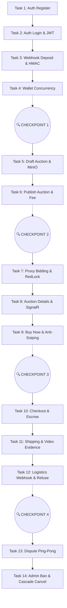

# Kế Hoạch Triển Khai SafeBid (Vertical Slices)

## Task 1: Auth - Register & Rate Limiting (F1)
- **Mục tiêu**: Người dùng đăng ký tài khoản mới và bị giới hạn số lần thử (Rate limit).
- **Tiêu chí hoàn thành (Given/When/Then)**:
  - Given user chưa có tài khoản, When đăng ký, Then tạo user (HealthScore=100, Bronze).
  - Given user đăng nhập/đăng ký sai > 5 lần/phút, Then trả 429.
- **Lớp chạm tới**: DB (Bảng User) / API (Endpoints) / UI (Form đăng ký).
- **Endpoint | Màn hình**: `POST /auth/register` | Trang Đăng ký.
- **File dự kiến**: `AuthValidator.cs`, `AuthController.cs`, `RegisterCommand.cs`, `RegisterPage.tsx`.
- **Test**: Integration test cho 429 Rate Limit và DB Insert thành công.
- **Skill / MCP gợi ý**: `frontend-ui-engineering` (cho Form), `dotnet-architect`.
- **Rủi ro liên quan**: Không có.
- **Testing Steps để test tay**: Bật FE, nhập form sai 6 lần liên tiếp xem có bị chặn 429 không. Nhập form đúng xem DB có lưu không.
- **Phụ thuộc**: Không.

## Task 2: Auth - Login & JWT HttpOnly (F1)
- **Mục tiêu**: Người dùng đăng nhập, nhận JWT qua HttpOnly cookie để bảo mật XSS.
- **Tiêu chí hoàn thành**: Given login thành công, When trả về kết quả, Then JWT lưu HttpOnly Cookie.
- **Lớp chạm tới**: API (Auth/JWT config) / UI (Zustand Session).
- **Endpoint | Màn hình**: `POST /auth/login`, `GET /users/me` | Trang Đăng nhập.
- **File dự kiến**: `JwtService.cs`, `AuthController.cs`, `authStore.ts`, `LoginPage.tsx`.
- **Test**: Unit test verify password hash, E2E login flow.
- **Skill / MCP gợi ý**: `security-and-hardening`.
- **Rủi ro liên quan**: XSS rò rỉ token.
- **Testing Steps để test tay**: Đăng nhập, mở DevTools (Application) kiểm tra Cookie có HttpOnly=true không. F5 trang xem profile còn giữ không.
- **Phụ thuộc**: Task 1.

---
🔍 CHECKPOINT REVIEW
---

## Task 3: Wallet - Deposit Webhook (F3) [HIGH RISK]
- **Mục tiêu**: Xử lý Webhook nạp tiền an toàn tuyệt đối từ Payment Gateway.
- **Tiêu chí hoàn thành**: Given Webhook trả về SUCCESS, When hệ thống xử lý, Then verify HMAC-SHA256, Idempotency và Replay Prevention (Timestamp ±5 phút).
- **Lớp chạm tới**: DB (Ledger) / API (Webhook Middleware).
- **Endpoint | Màn hình**: `POST /wallet/deposit`, `POST /webhooks/payment` | Trang Ví (UI nạp tiền).
- **File dự kiến**: `HmacMiddleware.cs`, `PaymentWebhookCommand.cs`, `WalletPage.tsx`.
- **Test**: Integration test (giả lập webhook fake -> 401, replay cũ -> 401, replay trùng ID -> 200 idempotency).
- **Skill / MCP gợi ý**: `doubt-driven-development`, `security-and-hardening`.
- **Rủi ro liên quan**: RISKS.md #4 (Webhook giả mạo).
- **Testing Steps để test tay**: Dùng Postman bắn Webhook POST sai chữ ký xem có bị 401 không.
- **Phụ thuộc**: Task 2.

## Task 4: Wallet - Balance & Optimistic Concurrency (F3) [HIGH RISK]
- **Mục tiêu**: Lấy số dư và chặn Double-Submit trừ lố tiền.
- **Tiêu chí hoàn thành**: Given User nạp/rút liên tục, When thao tác đồng thời, Then văng DbUpdateConcurrencyException.
- **Lớp chạm tới**: DB (Wallet RowVersion) / API.
- **Endpoint | Màn hình**: `GET /wallet/balance`, `GET /wallet/transactions` | Trang Ví.
- **File dự kiến**: `Wallet.cs`, `GetBalanceQuery.cs`, `WithdrawCommand.cs`.
- **Test**: Integration Test chạy 2 luồng rút tiền song song, verify chỉ 1 luồng thành công.
- **Skill / MCP gợi ý**: `database-design`.
- **Rủi ro liên quan**: RISKS.md #2 (Trừ lố số dư).
- **Testing Steps để test tay**: Mở 2 tab trình duyệt, click Rút tiền thật nhanh cùng 1 lúc xem số dư có bị âm không.
- **Phụ thuộc**: Task 3.

## Task 5: Auction - Create Draft & MinIO Upload (F4)
- **Mục tiêu**: Upload ảnh bằng chứng lên MinIO bucket temp/ và tạo bản nháp.
- **Tiêu chí hoàn thành**: Given Seller tạo phiên, When chưa xuất bản, Then ảnh vào temp/ và phiên trạng thái DRAFT.
- **Lớp chạm tới**: API (MinIO Client) / UI (File Uploader).
- **Endpoint | Màn hình**: `POST /media/upload`, `POST /auctions` | Trang Tạo Phiên.
- **File dự kiến**: `MinioService.cs`, `CreateAuctionCommand.cs`, `CreateAuctionPage.tsx`.
- **Test**: Unit test Minio upload logic.
- **Skill / MCP gợi ý**: `frontend-ui-engineering`.
- **Rủi ro liên quan**: Trash files đầy ổ (cần cấu hình TTL cho temp/).
- **Testing Steps để test tay**: Chọn ảnh up lên, kiểm tra xem có lấy được link temp không. Bấm lưu nháp.
- **Phụ thuộc**: Task 2.

---
🔍 CHECKPOINT REVIEW
---

## Task 6: Auction - Publish & Listing Fee (F4)
- **Mục tiêu**: Đăng bán chính thức và trừ phí Listing.
- **Tiêu chí hoàn thành**: Given Seller xuất bản DRAFT, When số dư đủ, Then trừ phí ví, chuyển file sang public-products/ và trạng thái ACTIVE.
- **Lớp chạm tới**: DB (Transaction) / API.
- **Endpoint | Màn hình**: `POST /auctions/{id}/publish` | Nút Publish ở Chi Tiết Nháp.
- **File dự kiến**: `PublishAuctionCommand.cs`, `AuctionStatus.cs`.
- **Test**: Integration test giao dịch nhiều bảng (Wallet + Auction + Ledger).
- **Skill / MCP gợi ý**: `dotnet-architect`.
- **Rủi ro liên quan**: Không thu được phí nhưng vẫn publish (mất tính ACID).
- **Testing Steps để test tay**: Bấm Publish, check xem số dư ví có bị trừ đúng phí Reserve Price không.
- **Phụ thuộc**: Task 4, Task 5.

## Task 7: Proxy Bidding & RedLock (F5) [HIGH RISK - CRITICAL]
- **Mục tiêu**: Xử lý logic đấu giá cốt lõi, hoàn toàn In-memory chống Race Condition.
- **Tiêu chí hoàn thành**: Given nhiều người đặt MaxBid cùng lúc, When xử lý, Then dùng RedLock khóa AuctionId, tính toán In-Memory, và SaveChanges 1 lần.
- **Lớp chạm tới**: DB / API (Redis).
- **Endpoint | Màn hình**: `POST /auctions/{id}/bids` | Modal Đặt giá.
- **File dự kiến**: `PlaceBidCommand.cs`, `BidEngine.cs`, `RedisLockService.cs`.
- **Test**: **Load test (Spike)** 100 concurrent requests cùng bid vào 1 Auction.
- **Skill / MCP gợi ý**: `doubt-driven-development`, `performance-optimization`.
- **Rủi ro liên quan**: RISKS.md #1 (Race condition Proxy Bidding).
- **Testing Steps để test tay**: Dùng tool đập 50 requests/s vào endpoint Bid xem server có bị Deadlock hay sai giá không.
- **Phụ thuộc**: Task 6.

## Task 8: Auction Details & Real-time SignalR (F5)
- **Mục tiêu**: Giao diện chi tiết phiên và update giá real-time.
- **Tiêu chí hoàn thành**: Given có bid mới, When giá thay đổi, Then SignalR bắn DTO Ping xuống Client để fetch lại dữ liệu hoặc update màn hình ngay lập tức (flip clock).
- **Lớp chạm tới**: API (SignalR) / UI (WebSocket Hook).
- **Endpoint | Màn hình**: `GET /auctions/{id}`, `Hub /hubs/auction` | Trang Chi tiết phiên.
- **File dự kiến**: `AuctionHub.cs`, `AuctionDetailPage.tsx`, `useSignalR.ts`.
- **Test**: E2E test 2 user mở cùng trang xem có nhận Ping ko.
- **Skill / MCP gợi ý**: `frontend-ui-engineering`.
- **Rủi ro liên quan**: Không có.
- **Testing Steps để test tay**: Mở 2 browser. Tab 1 đặt giá, tab 2 thấy giá nhảy lập tức mà không cần F5.
- **Phụ thuộc**: Task 7.

---
🔍 CHECKPOINT REVIEW
---

## Task 9: Buy Now & Anti-Sniping (F5)
- **Mục tiêu**: Mua đứt hoặc gia hạn thời gian nếu có bid sát giờ.
- **Tiêu chí hoàn thành**: Given phiên <= 5 phút, When có bid, Then gia hạn thêm thời gian (nhưng max T0 + 2h).
- **Lớp chạm tới**: Domain Logic.
- **Endpoint | Màn hình**: `POST /auctions/{id}/buy-now` | Nút Mua ngay.
- **File dự kiến**: `AuctionEngine.AntiSniping.cs`, `BuyNowCommand.cs`.
- **Test**: Unit test AntiSniping logic (cộng giờ, max limit).
- **Skill / MCP gợi ý**: `test-driven-development`.
- **Rủi ro liên quan**: RISKS.md #3 (Business Logic DoS - spam kéo dài phiên vô tận).
- **Testing Steps để test tay**: Chỉnh EndTime trên DB còn 1 phút, vào đặt bid xem thời gian có nảy lên không.
- **Phụ thuộc**: Task 7.

## Task 10: Checkout & Escrow (F6)
- **Mục tiêu**: Winner nạp đủ tiền và chốt địa chỉ nhận hàng.
- **Tiêu chí hoàn thành**: Given phiên kết thúc, When Winner chốt đơn, Then Hold 100% tiền vào Escrow, tạo Order (AWAITING_SHIPMENT).
- **Lớp chạm tới**: DB / API / UI.
- **Endpoint | Màn hình**: `POST /auctions/{id}/confirm-checkout` | Trang Xác Nhận Mua.
- **File dự kiến**: `CheckoutCommand.cs`, `Order.cs`, `CheckoutPage.tsx`.
- **Test**: Integration test trừ tiền, đổi status Order.
- **Skill / MCP gợi ý**: Không.
- **Rủi ro liên quan**: Thiếu tiền vẫn checkout thành công.
- **Testing Steps để test tay**: Trúng đấu giá, bấm Xác nhận xem tiền ví có Hold sang Escrow không.
- **Phụ thuộc**: Task 8.

## Task 11: Shipping & Video Evidence (F7)
- **Mục tiêu**: Seller tải lên bằng chứng đóng gói (vào bucket `private-evidence`) và bấm Giao hàng. Kích hoạt Outbox.
- **Tiêu chí hoàn thành**: Given Order đã thanh toán, When Seller xác nhận giao, Then upload video và hệ thống gửi Outbox qua Service B.
- **Lớp chạm tới**: API (Outbox, MinIO) / UI.
- **Endpoint | Màn hình**: `POST /orders/{id}/ship`, `POST /media/upload` | Trang Quản lý Đơn (Seller).
- **File dự kiến**: `ShipOrderCommand.cs`, `OutboxMessage.cs`, `OrderPage.tsx`.
- **Test**: Integration test lưu Outbox cùng Transaction với Order update.
- **Skill / MCP gợi ý**: `ci-cd-and-automation` (cho Outbox Worker).
- **Rủi ro liên quan**: Outbox không chạy (Saga fail).
- **Testing Steps để test tay**: Seller bấm Giao hàng. Kiểm tra DB xem bảng OutboxMessage có dòng nào không. Chờ Hangfire Worker xử lý nó.
- **Phụ thuộc**: Task 10.

---
🔍 CHECKPOINT REVIEW
---

## Task 12: Logistics Webhook & Refuse (F8)
- **Mục tiêu**: Nhận Webhook từ Service B cập nhật lộ trình.
- **Tiêu chí hoàn thành**: Given Service B gửi DELIVERED, When xử lý, Then Buyer có thể Refuse.
- **Lớp chạm tới**: API.
- **Endpoint | Màn hình**: `POST /webhooks/logistics`, `POST /orders/{id}/refuse` | Trang Chi tiết đơn hàng.
- **File dự kiến**: `LogisticsWebhookCommand.cs`, `RefuseOrderCommand.cs`.
- **Test**: Webhook HMAC test.
- **Skill / MCP gợi ý**: `security-and-hardening`.
- **Rủi ro liên quan**: Fake webhook logistics.
- **Testing Steps để test tay**: Bắn fake Webhook Delivered từ Postman, lên web xem nút "Refuse / Khiếu nại" hiện lên chưa.
- **Phụ thuộc**: Task 11.

## Task 13: Dispute Ping-Pong (F9)
- **Mục tiêu**: Chức năng thương lượng hoàn tiền (Ping-pong).
- **Tiêu chí hoàn thành**: Given Order DISPUTE, When thương lượng, Then max 3 vòng ping-pong chốt %.
- **Lớp chạm tới**: DB / UI.
- **Endpoint | Màn hình**: `POST /disputes/{id}/negotiate`, `POST /disputes/{id}/accept` | Trang Tranh chấp.
- **File dự kiến**: `Dispute.cs`, `NegotiateCommand.cs`, `DisputePage.tsx`.
- **Test**: Unit test đếm số vòng đàm phán tối đa.
- **Skill / MCP gợi ý**: `frontend-ui-engineering`.
- **Rủi ro liên quan**: Deadlock nếu 1 bên ngừng trả lời.
- **Testing Steps để test tay**: Buyer đề xuất 50%, Seller bấm Chấp nhận -> Escrow chia 50-50 ngay lập tức.
- **Phụ thuộc**: Task 12.

## Task 14: Admin Ban & Cascade Cancel (F10) [HIGH RISK]
- **Mục tiêu**: Admin khóa User và thu hồi tẩu tán tài sản (Cascade Confiscation).
- **Tiêu chí hoàn thành**: Given User bị Ban, When xử lý dở dang, Then tiền ví + cọc bị quét thẳng vào System_Insurance_Fund (IsConfiscated=true), hủy mọi giao dịch rút tiền đang chờ.
- **Lớp chạm tới**: DB / API.
- **Endpoint | Màn hình**: `POST /admin/users/{id}/ban` | Admin Panel.
- **File dự kiến**: `BanUserCommand.cs`, `CascadeConfiscationDomainService.cs`.
- **Test**: Integration test (Ban 1 user có 3 đơn hàng dở dang, check số dư ví và quỹ bảo hiểm).
- **Skill / MCP gợi ý**: `doubt-driven-development`.
- **Rủi ro liên quan**: RISKS.md #6 (Tẩu tán tài sản), #5 (Deadlock khi giải quyết tranh chấp).
- **Testing Steps để test tay**: Đặt lệnh Rút Tiền PENDING. Đăng nhập Admin bấm BAN user. Kiểm tra lệnh Rút Tiền bị HỦY và tiền bay vào quỹ bảo hiểm.
- **Phụ thuộc**: Tất cả các tasks trên.
